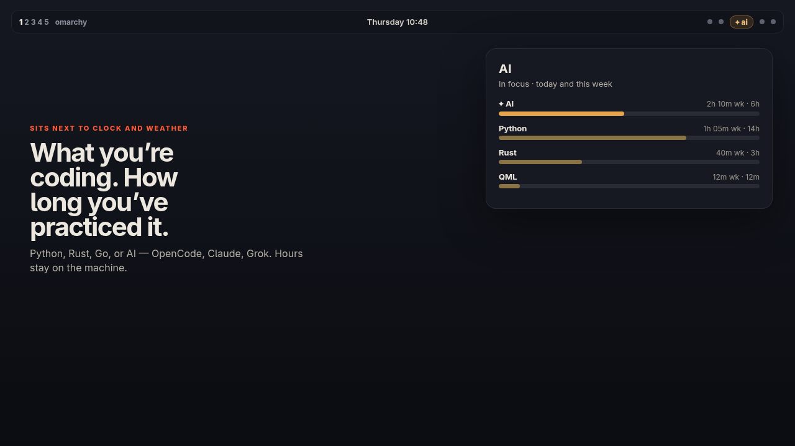

# OmaCapy



Language and AI practice on the [Omarchy](https://omarchy.org/) bar.

The badge follows what you are in — Python, Rust, Go (nvim-style icons) or **AI** when the focus is OpenCode, Claude, Grok, Codex, ChatGPT. A thin bar is how much you have practiced that stack. Click for today / this week / lifetime hours.

No pets. No accounts. No network.

## How it sees the file

- Window title (VS Code, Cursor, Zed, JetBrains)
- Process tree of the focused window (so Ghostty `trabalho: ~` still finds `nvim` / `opencode` / `grok`)
- Optional nvim hook: copy `nvim/omacapy.lua` to `~/.config/nvim/plugin/omacapy.lua`

A focused `.py` wins over an agent in the same terminal. Idle browsers do not count.

## Badge

- **Left-click** — open / close the stack

State: `~/.local/state/omarchy/omacapy.json`  
Nvim hint: `~/.local/state/omarchy/omacapy-lang`

## Install

```bash
omarchy plugin add https://github.com/Esegnorelli/omarchy-omacapy.git --enable
```

```bash
omarchy plugin validate .
omarchy plugin add "$PWD" --enable
```

```bash
omarchy bar move esegnorelli.omacapy --section right
```

## Remove

```bash
omarchy plugin disable esegnorelli.omacapy
omarchy plugin remove esegnorelli.omacapy --yes
# optional: rm ~/.local/state/omarchy/omacapy.json ~/.local/state/omarchy/omacapy-lang
```

## Requirements

- Omarchy Quattro shell
- `hyprctl` and `jq` (already on Omarchy), for the process scan
- Nothing else

## License

MIT
